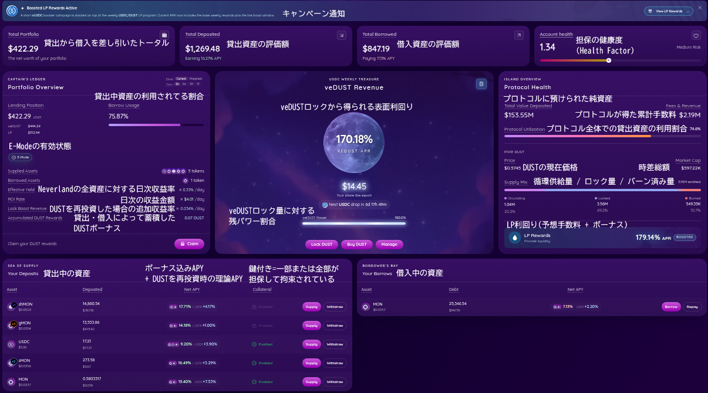

日常的な資産の状態チェックや戦略決めは、この画面だけ見ておけばいいです。

情報の重要度としては、以下のようになります。

↑高

- Account Health: (1を下回ると、担保が精算)
- Total Deposited/Borrowed: APYの差 (借入金利が上回っていると、じわじわ損失)
- Borrow Usage や Protocol: Utilization (100%に張り付いていると、取り付け騒動の危険性がある)
- Accumulated DUST Rewards: (Epochの前に再投資がおすすめ)
- Your Deposits: APYリターンを下げてる資産をスクリーニング(特にLP報酬のnUSDC)
- PIXIE DUSTやTotal Value Deposited: 普段と変わりがないか(Neverland住民の動向が大まかにわかる)
- その他: イールドを見てニヤニヤする以外、あまり重要ではありません。

↓低

