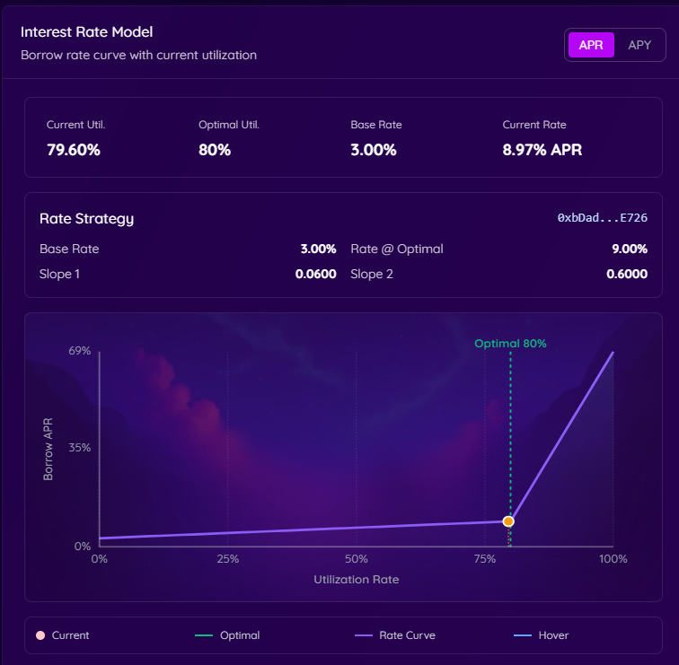

Monadやステーブルコイン、MonadのLST（リキッドステーキングトークン）、WBTC、WETHなどを貸出して金利を得ることができます。

また、Aave系プロトコルに共通しますが、**貸出金利 > 借入金利 が成り立っている（逆ザヤ状態）**のとき、借入して更に貸し出す……を繰り返す戦略（ループ戦略）が有効です。

2026年4月現在、ループ戦略を１回で実行するような、フラッシュローン等のしくみは実装されていないため、手動でループを組むことになります。

### 金利の決定

金利は **需要と供給によって自動的に決まります**。貸したい人が多くて借りたい人が少なければ金利は下がり、借りたい人が増えれば金利は上がる——いわゆる市場原理です。スマートコントラクトがリアルタイムで計算するため、誰かが手動で設定するわけではありません。

指標となるのが **稼働率（利用率）** で、プールに預けられた資産の借入利用率が高いほど金利が上がります。

代表として、Monadの金利変化を見てみましょう！

:::tip
Neverlandで借入／貸出したnWMONなどのトークンは、枚数が増える仕組みになっています(報酬型)。

対して、shMonなどLSTは、ベーストークンを基準とした価値が上昇する仕組みになっています。(リベース型)
いずれも複利として機能します。
:::

借入／貸出金利の計算式は単利(APR) ですが、**実際に貰える／払う金利 は複利計算(APY)** です。

#### 通常時

`借入金利 = BaseRate + Slope1 × (稼働率 / Rate@Optimal)`

利用率0%のとき、借入金利は3%で、利用率80%のとき金利9%まで、線形に増加します。

#### 逼迫時

`借入金利 = BaseRate + Slope1 + Slope2 × ((稼働率 - 80%) / 20%)`

利用率80%から100%のとき、金利は9%から69%まで線形に増加します。

正式な計算式は[コントラクト](https://monadvision.com/address/0xbDad50bda8F044569e076AEB2418c0910F10E726?tab=Contract)の `DefaultReserveInterestRateStrategy.sol` にあります。

### なんで逆ザヤになるの？

通常、借入金利が貸出金利を上回るのが自然な状態です。では、なぜ逆ザヤが起きるのか？

ポイントは**LSTのステーキング報酬**にあります。sMon・gMon・shMonといったLSTは、保有しているだけでベースのステーキング金利が発生します。これに加えてレンディング金利も乗ってくるため、実質的な利回りが借入コストを超えることがあります。

Neverlandの住民たちには、貸出金利が大きいならループポジションを大きくし、貸出金利が大きいなら、ポジションを解体するインセンティブが働くので、金利は均衡するはずですが、金利カーブや精算リスクのプレッシャーから、貸出を恐れるのが大衆心理です。

現実的には「貸出リターン > 借入コスト」という状態がほぼ常態化しており、借りて再び預けるループ戦略が理論上プラスになるわけです。

:::caution
借入してる場合は、放置しすぎないように、担保状態や金利は時々チェックしましょう！
:::
