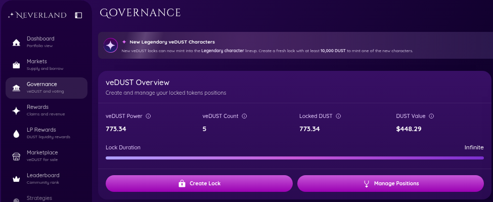
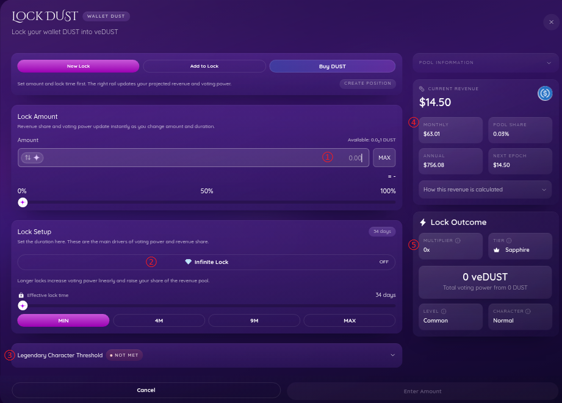
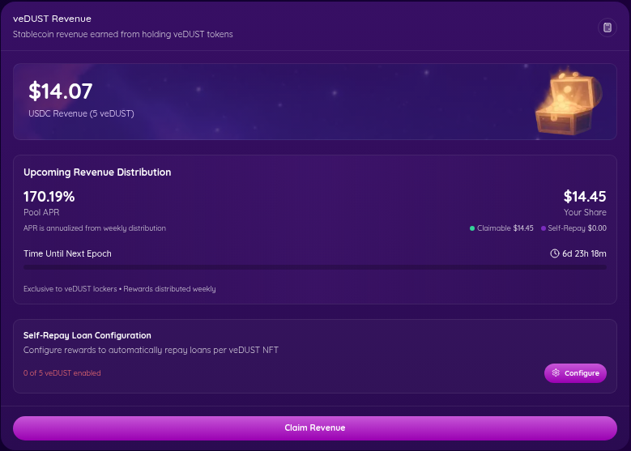
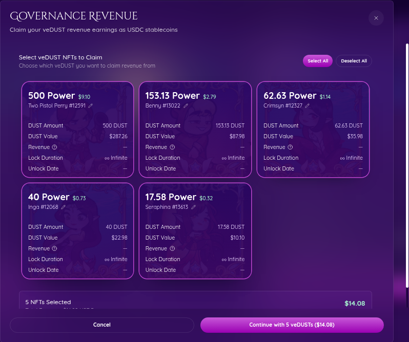
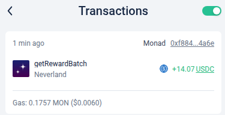

Neverlandでは、[DUST](0xad96c3dffcd6374294e2573a7fbba96097cc8d7c) がガバナンストークンです。

DUSTは保有しているだけでは、一切の効力を持ちません。

ロックすることで、veDUST NFTに変化し、初めて効力を発揮します。

ガバナンストークンの主目的はプロジェクトの収益配分などの投票権（株でいう議決権）ですが、

Neverlandには、**プロトコル収入の一部をveDUST NFT保有者に配分する仕組み**があります。
これにより、**2026/04時点では、APR170%前後のUSDCが週次配分されます**

:::note
veDUSTによる投票システムは未実装です。

おそらく、プロトコルが安定し、veDUSTホルダーが増加した段階で実装され、徐々に主体がコアメンバーからホルダーへ移っていくと予想されます。
:::

## 報酬システム

報酬はepoch(日本時間で毎週木曜日、午前9時)という単位が満了時点でのveDUSTパワーで決定されます。(スナップショット方式)

報酬プールが10K USDC、あなたのプール内シェアが0.1%だと仮定すると、epoch満了の報酬は 10 USDC となります。

:::note
1年間に、epochはおよそ52.2回あるため、表示上のAPRは、

$ APR = \dfrac{\mathrm{epoch報酬プール総額}}{\mathrm{veDUST時価総額}} \times 52.2$

となり、比例配分であることから、あなたの保有量ベースで計算しても同じ結果が得られます。

$ APR = \dfrac{\mathrm{あなたに割当のepoch予定報酬}}{\mathrm{あなたのveDUST評価額}} \times 52.2$
:::

## Time-Lock（期限付きロック）と Infinity-Lock(永久ロック)

DUSTをロックして得られるveDUST Power(効力)はかならずしも一定ではありません。

DUSTをロックすると、設定した期限に近づくにつれPowerは減衰していき、やがてゼロになります。
:::note
WhitePaper
https://docs.neverland.money/vedust-mechanics#core-formula
:::

**しかし、Infinity-Lockの場合は、veDUST Power はロックしたDUST量とイコールのまま、一切減衰しません。**

流動性と、veDUST収益はトレードオフの関係となっています。

:::tip
ペナルティ(残存期間に比例)を支払い、ロックを解除することができます。
**ペナルティ分のDUSTは完全にバーンされます。**

また、**Infinity-Lockを解除する場合、一律75%という非常に重いペナルティが課されます。**

「epochをまたぐ瞬間に巨額をロックして、報酬をもらったら資金を抜く」というムーブが事実上不可能な設計となっています。

WhitePaper
https://docs.neverland.money/vedust-mechanics#early-unlocks-and-fair-penalties
:::

## veDUSTロックしてみよう

Governance メニューから、ロック画面に進みます。

↓ ↓ ↓

| #   | 項目                                | 説明                                                                                                                |
| --- | ----------------------------------- | ------------------------------------------------------------------------------------------------------------------- |
| ①   | Amount                              | ロック量したいDUST量を指定します。                                                                                  |
| ②   | InfinityLock                        | Infinite-Lockと、Time-Lockをトグルします。                                                                          |
| ②   | Effective lock time                 | Time-Lockの場合のみ、ロック期間を選択できます。                                                                     |
| ③   | Legendary Character Threshold       | 10k DUST以上を新規ロックすると、Legendary NFTがMintされます。                                                       |
| ④   | CURRENT REVENUE / PROJECTED REVENUE | 算出されたAPRが表示されます。Amountを入力すると、ロック後の予測へ h表示が変わります。                               |
| ⑤   | MULTIPLIER                          | ロックするDUSTに対して、どれくらいのveDUSTパワー（効力）が得られるかの倍率です。                                    |
| ⑤   | TIER                                | 期間に応じて、Supphire < Emerald < Ruby < Diamond(Infinity-Lock)が変化します。**NFTカードの装飾のみに影響します。** |
| ⑤   | LEVEL                               | ロック量に応じて、NFTのレア度が変化します。レアリティによった特別な効果はありません                                 |
| ⑤   | CHARACTER                           | 特別な効果はありませんが、基準を超えるサイズのロックの場合、特別なキャラクターがMintされる可能性があります。        |

:::note
高レアNFTに特殊効果はありませんが、プレミア価格が期待できるほか、将来的には特典の対象となる可能性があります。

大金が必要になるため、セキュリティ対策を徹底したうえで、慎重に検討しましょう。
:::

## 報酬のclaim(請求)

veDUST報酬は、claimするか、self-repaying loan(後述) を設定しない限り、Rewards画面に残り続けます。
放置しても消滅はしませんが、**効率的に複利効果を得るためには、なるべく放置しないようにしましょう！**

:::tip
毎週のめんどくさければSelf-Repay Loanの設定も効果的です。

また、epochの前後は、DUSTやNFTのボラティリティが激しく、割安で購入したり、高く売ったりするチャンスでもあります。
:::

報酬claim画面

↓ ↓ ↓

ガス代を支払うことで、ウォレットへUSDCが転送されます。

:::tip
claim後はウォレットやトランザクションを必ず確認しましょう。

ネイティブなUSDCのため、自動運用はされません。
再投資も利確も自由なので、有効に使いましょう！

:::

## Self-Repay Loan(自己返済ローン)

**epoch毎のveDUST報酬を自動的に借入を支払いする機能です。**
設定して放置することにより、借入残債を自動的に減らし、ポジションを健全化することが可能です。

:::tip
手動でアクションしなくても複利効果を得ることができますが、貸出金利 > 借入金利 が成り立っている場合、返済よりも、貸出の原資としたほうが、理論上の資金効率は良いです。

こまめにダッシュボード見る人や、割安タイミングでスワップしたい人は、あえてオフにするのも効果的です。
:::
