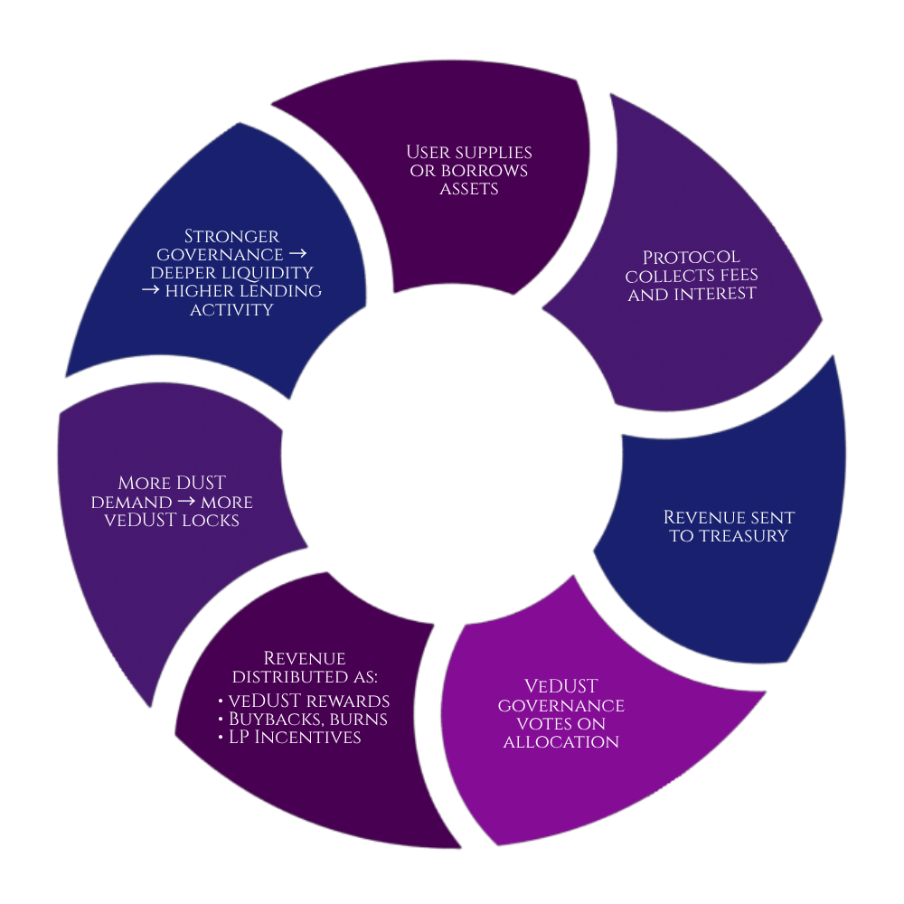

NeverlandはMonadチェーン上に構築された、次世代のレンディングプロトコルです。

フォーク元のAaveV3にあるようなレンディングシステムに加え、さまざま方法でイールドファーミングすることができます。

## 特徴

Neverlandの最大の特徴は、**プロトコルが生み出す収益の100%をユーザーに分配する**点にあります。

一般的なDeFiプロトコルでは、収益の一部が運営側やトレジャリーに配分されますが、Neverlandはその構造を取り払い、プロトコルが稼いだすべての利益をコミュニティへ還元します。

レンディングの金利収入、流動性提供の手数料、そして自動化された戦略によって生まれた収益——
これらすべてが、プロトコルに参加するユーザーのものになります。

「プロトコルやVC(機関投資家)のために稼ぐ」のではなく、「自分のために稼ぐ」仕組みです。

## 収益構造のフライホイール

Neverlandは、住民各自が自己利益の最大化を求めることで、自然と収益が循環する仕組みになっています。

1. ユーザーが資産を供給または借入する
1. プロトコルが手数料と利息を回収する
1. 収益が Treasury に送られる
1. veDUST ガバナンスが収益配分を決定する
1. 収益が veDUST 報酬・Buyback/Burn・LP インセンティブとして分配される
1. DUST の需要が増え、より多くの veDUST ロックが行われる
1. ガバナンスが強化され、流動性が深まり、貸付活動が増加する

出展: https://docs.neverland.money/#id-4.-the-neverland-flywheel

---

## FAQ

### どうやって稼ぐの？

- **[レンディング](/guides/lend-borrow):** トークンを貸出して金利を受け取ることができます。
- **[veDUSTロック](/guides/vedust-lock):** ガバナンストークンであるDUSTをロックすることで、週1回報酬がもらえます。
- **[LP（流動性提供）](/guides/liquidity-provider):** USDC-DUSTペアの流動性をUniswapV2に提供することで報酬がもらえます。

### ポンジじゃないの？

Neverlandの収益は、レンディングの借り手が支払う金利や、流動性プールの取引手数料など、**実際の経済活動から生まれています**。

新規参加者の資金で既存ユーザーに配当するポンジスキームとは根本的に異なります。
高い利回りの背景にあるのは、Monadのステーキング利回り、自動化されたループ戦略や流動性の効率的な再循環によるプロトコル設計です。

### エアドロの可能性は？

現時点でNeverlandはエアドロップについて公式な発表を行っていません。ただし、プロトコルへの積極的な参加——レンディング、veDUSTのロック、流動性提供——はいずれもプロトコルやMonadエコシステムへの貢献として記録されます。

**2026年4月現在、Monad最大級のDeFiへ成長しているため、Monad Foundation からのエアドロの可能性や、LST発行元からのエアドロの期待されています。**

### 後から参加すると不利では？

多くのプロジェクトと同じく、 `投資金額 ✕ 期間` によって、 `Pearls` がもらえます。
Pearlsに比例して、Tidesごとに(毎月)報酬に当選するチャンスがあります。

Neverlandでは、PearlsはTidesごとにリセットされます。今から参加しても、翌月変わったらみんな平等にチャンスがあります。

また、リファラル（招待制）がないことから、インフルエンサー有利ということもありません。

### 全員が儲けられる仕組み？

残念ながら答えはNoです。

DeFiをはじめとする、あらゆる投資 において「出口戦略の難しさ」最大の問題であり、Neverland も例外ではありません。
住民全員が出口へ向かうと、プロトコルは破綻します。

現状は、預かり資産やプロトコル収益は順調に増加しており、Monad経済圏の拡大とともにパイが膨らんでいるフェーズです。

ダッシュボードやDeFiLlamaなどで、動向をチェックすることが大事です。

### プロジェクトは安全？リスクはある？

NeverlandのスマートコントラクトはサードパーティによるAudit（監査）が実施されており、コードの安全性は一定の検証を受けています。
ただし、DeFiである以上スマートコントラクトリスク、流動性リスクはゼロにはなりません。

流行りのDeFiに対して、世界中のハッカーたちは常にバグや脆弱性を探します。

また、Neverland自体に問題がなくとも、担保通貨自体のデペグリスクなどは無視できません。
(rsETHのハッキングがAaveV3に波及したのは記憶に新しいですね。)

**DYOR（Do Your Own Research＝自分で調査する）** を徹底し、余剰資金の範囲内で参加することを強く推奨します。

### 最低投資金額はいくら？何から始めたらいい？

$15~20 程度の金額で小さく始めることをおすすめします。

- 最低金額の 10 DUST を永久ロック
- E-Modeを有効化し、$10程度のLSTを貸出、WMonを借入、再度ステーキングして、LSTを貸出
